<p align="center">
  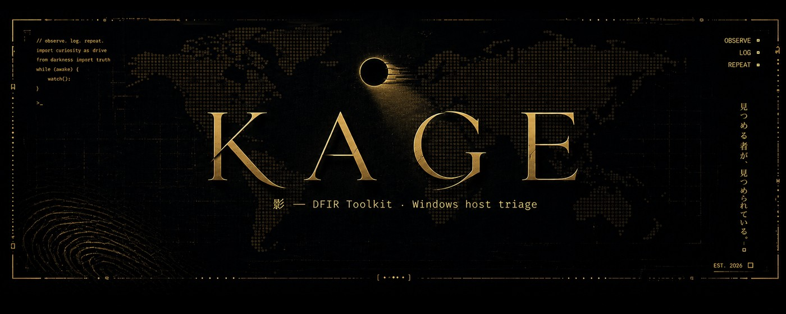
</p>

<p align="center">


</p>

<p align="center"><b>One host. One chain. A report you can defend.</b></p>

---

*Kage* (影) is the trace a thing leaves rather than the thing itself. That is the
job: separate an intrusion's trace from the noise the triage generates itself,
from routine administration, and from everything benign — then show the work
behind the verdict.

Point Kage at a suspect Windows host and it runs the whole triage in one chain:
**CyLR** collects the artefacts, **Hayabusa** correlates the event logs against
Sigma, **THOR Lite** scans for YARA matches, **VirusTotal** and **AbuseIPDB**
qualify the indicators, and the AI provider of your choice drafts the write-up.
Every stage streams live, seals what it produced, and can be replayed alone.

```bash
pip install -r requirements.txt
python -m dfirconsole          # → http://127.0.0.1:8787
```

<p align="center">
  
  <br><sub>The overview: eleven sealed steps on the left, the execution log
  streaming, and the score broken into its four components.</sub>
</p>

---

## 📑 Table of contents

- [Installation](#-installation)
- [Running your first scan](#-running-your-first-scan)
- [Adding THOR Lite manually](#-adding-thor-lite-manually)
- [The chain](#-the-chain)
- [Risk score](#-risk-score)
- [Alerts](#-alerts)
- [System context](#-system-context)
- [Logging & audit](#-logging--audit)
- [YARA](#-yara)
- [Seals](#-seals)
- [Views](#-views)
- [Configuration](#-configuration)
- [CLI reference](#-cli-reference)
- [Troubleshooting](#-troubleshooting)
- [Linux version](#-linux-version--in-progress)
- [Credits](#-credits)

---

## 📦 Installation

### Requirements

| | |
|---|---|
| OS | Windows 10 / 11 or Windows Server |
| Python | 3.10+ from [python.org](https://www.python.org/downloads/), **installed for all users** |
| Rights | **Administrator**  |
| Disk | a few GB free for the collection |


### Install

```powershell
# 1. Extract Kage anywhere — Desktop, C:\Kage, a USB stick, it does not matter
cd C:\Kage

# 2. Install the dependencies
pip install -r requirements.txt

# 3. Check the environment before touching a host
python preflight.py
```

`preflight.py` reports what is ready and what is missing.

```
Workspace   : C:\Kage
System      : Windows 11
Python      : 3.12.3

Dependencies
  [ok]   module fastapi
  [ok]   module uvicorn
  [ok]   module httpx

Rights and disk space
  [ok]   console running as administrator
  [ok]   free space: 84.2 GB

Tooling
  [!]    CyLR in C:\Kage\tools\cylr
           → the "Locate the tooling" step downloads it
  [!]    THOR Lite
           → optional step — it will simply be skipped
```

### Launch — as Administrator

```powershell
python -m dfirconsole
```

Or right-click **`launch.bat`** → *Run as administrator*, which handles the
virtualenv, the install and opens the browser for you.

```
Kage DFIR Toolkit 1.5.0
  code      C:\Kage\dfirconsole
  workspace C:\Kage
  open      http://127.0.0.1:8787
```

> **The workspace is wherever you launched from.** Nothing to configure. Tools,
> evidence and output all land next to the console.

### Try it with no risk first

```powershell
python -m dfirconsole --demo
```

Demonstration mode builds a synthetic intrusion — malicious attachment, encoded
PowerShell, Defender disabled, credential theft, persistence, C2, shadow copies
deleted — and runs the entire chain on it. Nothing on your machine is touched.
The best way to learn the interface before a real incident.

---

## 🚀 Running your first scan

### Step 1 — Open the console

Launch as administrator, open <http://127.0.0.1:8787>, and check the status bar
reads **`live run · Windows`** and not `demonstration mode`.

### Step 2 — Name the case

Click **Settings**:

| Field | Example | Why it matters |
|---|---|---|
| Case reference | `INC-2026-0042` | names the report, the log and the archive |
| Analyst | `N. Delaunay` | appears on the report header |

Leave **Workspace folder** empty it tracks the launch folder on its own.
Click **Save**.

### Step 3 — Warm up before committing

The left column is the **chain of custody**. Every step has a checkbox; all are
ticked by default except the YARA scan.

**For a first run, untick everything except:**

```
☑ Prepare the workspace
☑ Exclude the folder from Defender
☑ Locate the tooling
☑ Update the Sigma rules
```

Click **Run 4 steps**. About a minute. This downloads CyLR and Hayabusa and
confirms your elevation actually works *before* anything long begins.

### Step 4 — Collect and analyse

Once those four are sealed, tick the rest:

```
☑ Collect the artefacts        CyLR — a few minutes, several GB
☑ Capture the system context   accounts, sockets, disk root, log coverage
☑ Build the timeline           Hayabusa correlates against Sigma
☑ Analyse the timeline         score, alert families, indicators
```

Click **Run** and watch the execution log stream. Each finished step gets a
**seal** — a SHA-256 you can verify later.

### Step 5 — Read the results

| Where | What you get |
|---|---|
| **Overview** | risk score with its four components, alerts by family |
| **Alerts** | every alert, filterable by severity and family |
| **System** | accounts, sockets tied to processes, odd folders, log coverage |
| **Indicators** | hashes, IPs and domains extracted from the timeline |

**Click any table row** to open the reading pane: every field, the full command
line, all raw data. `←` `→` to move between items, `Esc` to close.

### Step 6 — Enrich and conclude *(optional)*

With API keys configured:

```
☑ Enrich the indicators    VirusTotal + AbuseIPDB reputation
☑ Write the summary        the AI drafts the report
```

Without keys, both are marked *skipped* and a **local write-up** is produced
instead — same structure, no network call.

### Step 7 — Export

Top right of the dashboard:

- **Report** — printable HTML, thirteen numbered sections, ready for PDF
- **JSON** — the complete state, seals included
- **Log** — everything the console produced

> 💡 **Replay a single step:** double-click its tag in the left column. Useful
> when Hayabusa fails but the collection is fine — no need to collect twice.

---

## 🔦 Adding THOR Lite manually

The YARA scan is the one step Kage **cannot** set up for you. Nextron requires
registration, so the binary cannot be fetched by a script. CyLR and Hayabusa
download themselves; THOR does not.

### 1. Get the archive

Register and download at
[nextron-systems.com/thor-lite](https://www.nextron-systems.com/thor-lite/).
You receive the scanner **and a licence file** (`.lic`) — usually by email.

### 2. Drop it in `tools\thor\`

Kage already created that folder for you at first launch. Copy the archive's
contents into it, **keeping everything together**:

```
C:\Kage\
└── tools\
    └── thor\                    ← everything goes here
        ├── thor64-lite.exe        the scanner
        ├── yourname.lic           the licence — THOR will not start without it
        ├── config\                from the archive
        ├── signatures\            from the archive — the YARA rules themselves
        └── custom-signatures\     from the archive
```

> **Why keep them together?** THOR runs from the directory holding its
> executable and resolves its signatures relative to that directory. Copying
> the binary alone gives you a scanner with nothing to scan for.

The other two tools live beside it, each in its own folder:

```
tools\
├── cylr\        CyLR.exe                 ← downloaded automatically
├── hayabusa\    hayabusa-<version>.exe   ← downloaded automatically
└── thor\        thor64-lite.exe + .lic   ← you place this one
```

### 3. Verify

```powershell
python preflight.py
```

```
Tooling
  [ok]   CyLR in C:\Kage\tools\cylr
  [ok]   Hayabusa in C:\Kage\tools\hayabusa
  [ok]   THOR Lite: C:\Kage\tools\thor\thor64-lite.exe
  [ok]   THOR licence file (*.lic)
```

If the licence line shows `[!]`, THOR will start and stop immediately.

### 4. Choose the scope — this decides everything

**Settings → YARA scan folder:**

| Value | Scans | Takes |
|---|---|---|
| *(empty)* | the artefacts CyLR just collected | minutes |
| `C:\Users\target` | one user profile | minutes |
| `C:\` | the whole system volume | **hours** |

Tick **YARA scan** in the chain and run it. Verdicts appear live as files are
examined — alerts, warnings, notices *and* clean files, each with its hash.

**No time limit by default.** A three-hour sweep is a decision, not an anomaly.
Set one in minutes if you want a ceiling.

> Without THOR, the step reports itself as *skipped* and the chain carries on.
> You lose the YARA axis of the score — nothing else.

---

## 🔗 The chain

Eleven steps. Tick what you need, double-click a tag to replay one alone.

| # | Step | What actually runs |
|---|---|---|
| 01 | Prepare the workspace | folder tree, elevation and free-space check |
| 02 | Exclude from Defender | `Add-MpPreference -ExclusionPath <workspace>` |
| 03 | Locate the tooling | resolves and downloads CyLR + Hayabusa from GitHub releases |
| 04 | Collect the artefacts | `CyLR.exe -od evidence\ -of <case>.zip -v` |
| 05 | Capture the system context | `systeminfo` · `Get-LocalUser` · `netstat -ano` · `tasklist` · `auditpol` |
| 06 | Update the Sigma rules | `hayabusa update-rules` |
| 07 | Build the timeline | `hayabusa <csv\|dfir>-timeline -d <Logs> -o hayabusa-output.csv -r <rules>` |
| 08 | Analyse the timeline | score, alert families, indicator extraction |
| 09 | YARA scan *(optional)* | `thor64-lite.exe --nocsv -p <chosen folder>` |
| 10 | Enrich the indicators | VirusTotal v3 · AbuseIPDB v2 |
| 11 | Write the summary | your AI provider, or a local write-up |

The Hayabusa subcommand is read from its own help output, so v3
(`csv-timeline`) and v4 (`dfir-timeline`) both work, and unsupported flags are
dropped rather than failing the command.

---

## 🎯 Risk score

A **triage priority, not a proof** — and never published without its breakdown.

```
80 / 100        Compromise confirmed by multiple sources
                CONFIDENCE HIGH · 441 events analysed

SEVERITY        45 / 45   8 critical, 10 high, 3 medium
KILL CHAIN      25 / 25   10 ATT&CK tactics, 7 decisive
REPUTATION       0 / 20   no indicator confirmed externally
CORROBORATION   10 / 10   3 YARA detections · 3 active connections to public hosts
```

Four independent axes, **each capped**. That is what stops one noisy rule firing
three hundred times from reaching the same verdict as a genuine multi-stage
intrusion.

**Confidence is separate from severity.** It counts how many independent sources
agree and whether logging coverage was sufficient — so a high score built on
Sigma alone reads as a strong lead, never a confirmation:

| Score | Confidence high | Confidence low |
|---|---|---|
| ≥ 70 | Compromise confirmed by multiple sources | Compromise highly likely — corroboration still limited |
| ≥ 45 | Likely compromise — containment recommended | Strong indications from a single source |
| ≥ 25 | Suspicious activity requiring qualification | |
| ≥ 10 | Weak signals, no established compromise | |
| < 10 | Nothing conclusive | |

Recomputed each time a new source lands — after the timeline, after YARA, after
enrichment.

---

## 🚨 Alerts

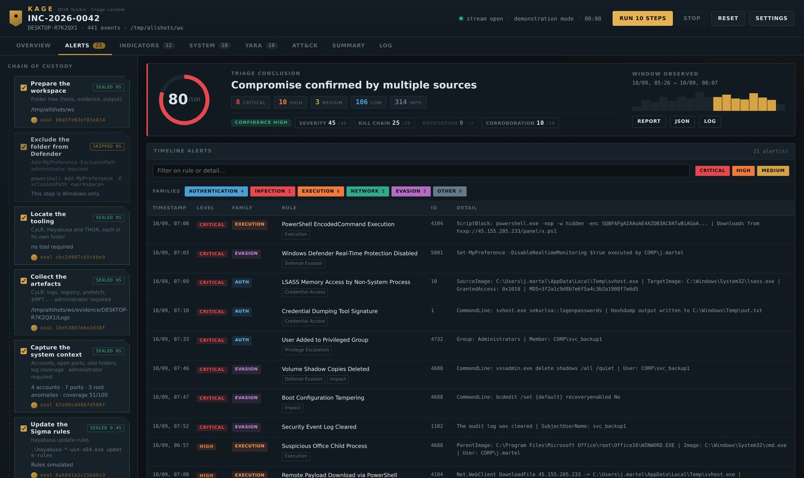

Severity says how urgent. Families say what kind.

```
FAMILIES   AUTHENTICATION 4   INFECTION 1   EXECUTION 6
           NETWORK 5          EVASION 5     OTHER 0

TIMESTAMP        LEVEL     FAMILY   RULE                              ID
09/09 10:26      CRITICAL  EVASION  Windows Defender Disabled         5001
09/09 11:09      CRITICAL  EVASION  Volume Shadow Copies Deleted      4688
09/09 11:15      CRITICAL  EVASION  Security Event Log Cleared        1102
09/09 10:32      CRITICAL  AUTH     LSASS Memory Access               10
```

Classified by event ID first, wording second. **When the two disagree, the text
wins**: a `4688` is a process creation, but `vssadmin delete shadows` belongs
under Evasion, because that is where an analyst will look for it.

**The family counts always match the table.** Computed over the alerts that
actually reach the list — a badge promising rows you cannot find is a bug, not a
detail.

**The histogram follows the selection.** With one family active, the observed
window is redrawn in that family's colour and a tick marks its busiest moment.

**The triage does not flag itself.** THOR writes to the Windows event log while
it runs, and scanning a folder of offensive binaries makes Hayabusa flag our own
scanner. Those events are excluded, counted apart, and the total reported.

---

## 🖥️ System context

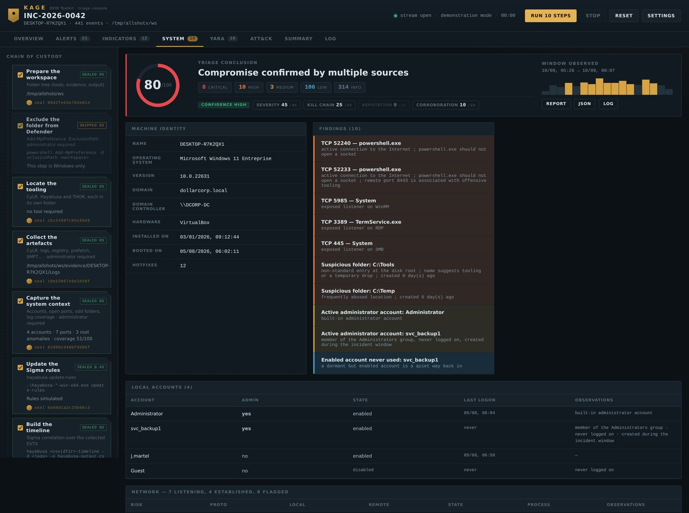

What no event log tells you, captured read-only:

```
NETWORK — 7 listening, 4 established, 8 flagged

RISK    PROTO  LOCAL              REMOTE                PROCESS
HIGH    TCP    10.20.4.11:52233   45.155.205.233:8443   powershell.exe
        → active connection to the Internet · powershell.exe should not
          open a socket · remote port 8443 associated with offensive tooling
HIGH    TCP    0.0.0.0:3389       —                     TermService.exe
        → exposed listener on RDP

ROOT C:\ — 3 flagged entries

HIGH    C:\Tools    folder   created 0 day(s) ago
        → non-standard entry at the disk root · name suggests tooling
HIGH    C:\Temp     folder   → frequently abused location
```

Every socket is matched to its owning process by **PID** — that cross-reference
is what makes `powershell.exe` holding a connection to a public host readable at
a glance.

Local accounts are checked for Administrators membership, dormant-but-enabled
state and last logon. Public addresses from **established** connections join the
indicator list automatically: an address being talked to during triage is worth
at least as much as one read from a three-day-old log entry.

---

## 📋 Logging & audit

A triage is only worth what the machine agreed to record.

```
LOGGING & AUDIT — coverage 51/100 · partial coverage

Blind spots: Sysmon · PowerShell (script blocks) · Process creation
             · Credential validation

STATE     CHANNEL                       IMPORTANCE   EVENTS
ACTIVE    Security                      critical     84 213
MISSING   Sysmon                        critical     —
EMPTY     PowerShell (script blocks)    critical     —
ACTIVE    System                        important    12 045
DISABLED  WinRM                         important    —
```

Sixteen channels classified **active / empty / disabled / missing** — the
distinction matters: an empty channel is one command away from fixed, a missing
one needs a deployment. Thirteen `auditpol` subcategories read alongside.

The coverage score sits next to the risk score. *Risk 80, coverage 51* means the
verdict rests on half the available information — and the report says so.

---

## 🔬 YARA

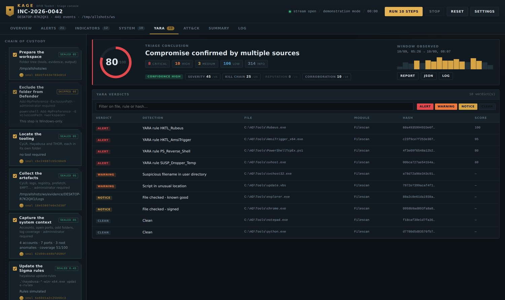

```
8 verdicts

VERDICT   DETECTION                   FILE                         HASH        SCORE
ALERT     YARA rule HKTL_Rubeus       C:\AD\Tools\Rubeus.exe       9c4133ee…   100
ALERT     YARA rule HKTL_AmsiTrigger  C:\AD\Tools\AmsiTrigger.exe  af7af55c…    95
ALERT     YARA rule PS_Reverse_Shell  C:\AD\Tools\PowerShellTcp…   ab1e98e8…    80
WARNING   Suspicious filename         C:\AD\Tools\svchost32.exe    6b6f1901…    —
NOTICE    File checked - signed       C:\AD\Tools\chrome.exe       c5a10bff…    —
CLEAN     Clean                       C:\AD\Tools\notepad.exe      20eded6a…    —
```

The page fills up **during** the scan, not only when something is found. That is
what separates *found nothing* from *looked at nothing*.

**The scan starts at the first real finding.** THOR opens every run with a dozen
banner lines — version, build, hostname, working directory, argument list,
uptime — and closes with a summary. None of it describes the host being
examined, so none of it reaches the view. Hashes from alerts are pushed into the
indicator list, ready for VirusTotal.

---

## 🔐 Seals

Each completed step is sealed with a SHA-256, and the seal **states what it
covers**:

```
✔ Analyse the timeline              SEALED 0.1s
  seal 31d1991a65598de8 — content of hayabusa-output.csv

✔ Exclude the folder from Defender  SEALED 6.2s
  seal 8f2c04b71ae93d55 — execution record (no file produced)
```

When a step produced files, the seal is the hash **of their contents** — rerun
it later and you have proof the artefact was not altered. When it produced none,
the seal covers only the execution record, and says so rather than implying
more.

---

## 🧭 Views

Every view has its own URL, reloads nothing and loses nothing — the analysis
lives server-side and a full refresh restores it.

| Address | Content |
|---|---|
| `/` | pipeline, execution log, breakdown by family |
| `/alerts` | alerts by severity and family |
| `/indicators` | indicators with VirusTotal / AbuseIPDB reputation |
| `/system` | machine, accounts, network, disk root, coverage |
| `/yara` | THOR verdicts, live during the scan |
| `/attack` | inferred ATT&CK tactics |
| `/summary` | written report |
| `/log` | full log, downloadable |

### Live execution

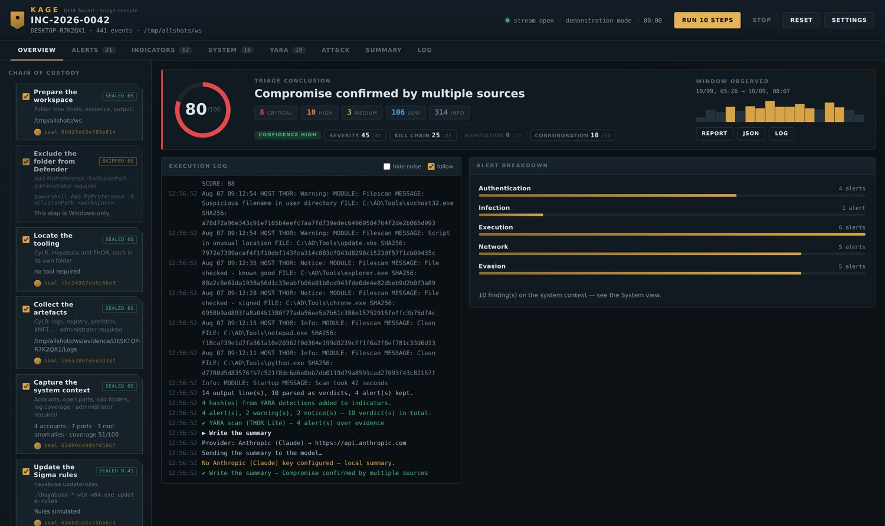

Every command streams as it runs. Steps seal one by one; the clock stops when
the chain does.

### Indicators

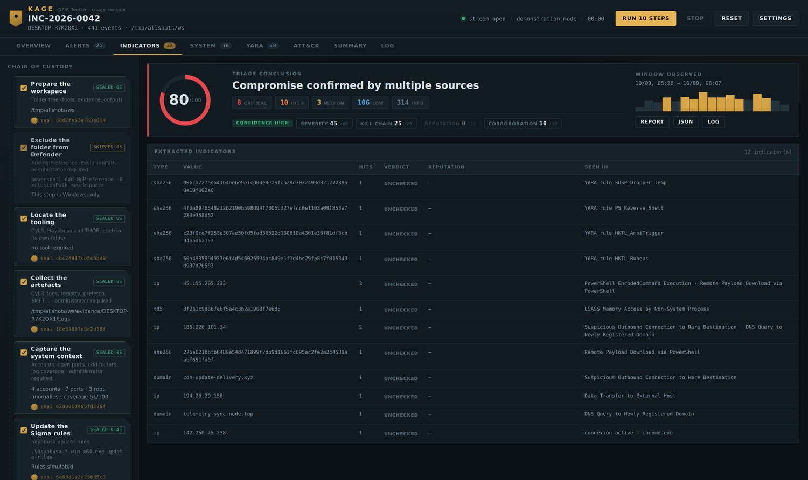

Hashes, IPs and domains pulled from the timeline, from active sockets, and from
YARA hits — each with its reputation once enrichment has run.

### ATT&CK tactics

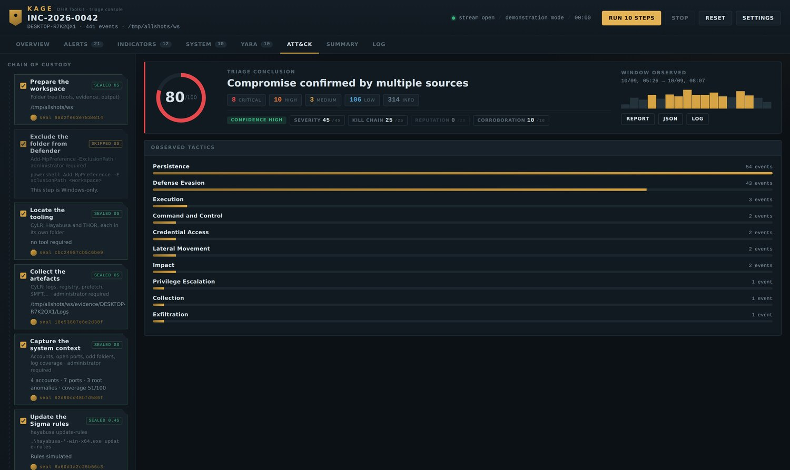

### Reading pane

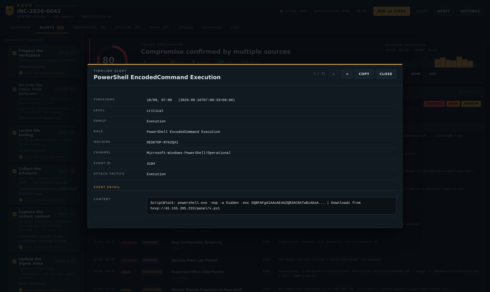

Any row, anywhere, opens in full: every field, the complete command line, the
raw THOR data. `←` `→` to move between items, `Esc` to close, **Copy** for JSON.

### Written summary

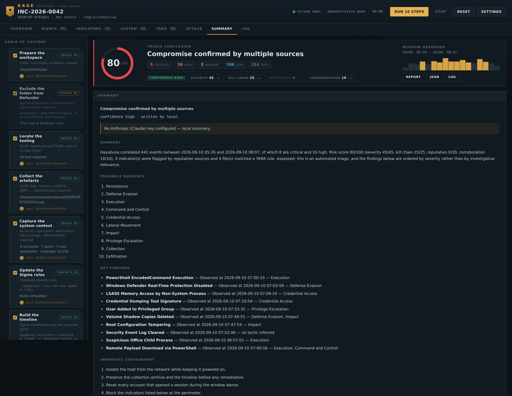

Observed facts separated from assessed ones, calibrated language, and an
explicit evidence-gaps section naming what the logging could not have shown.

### Settings

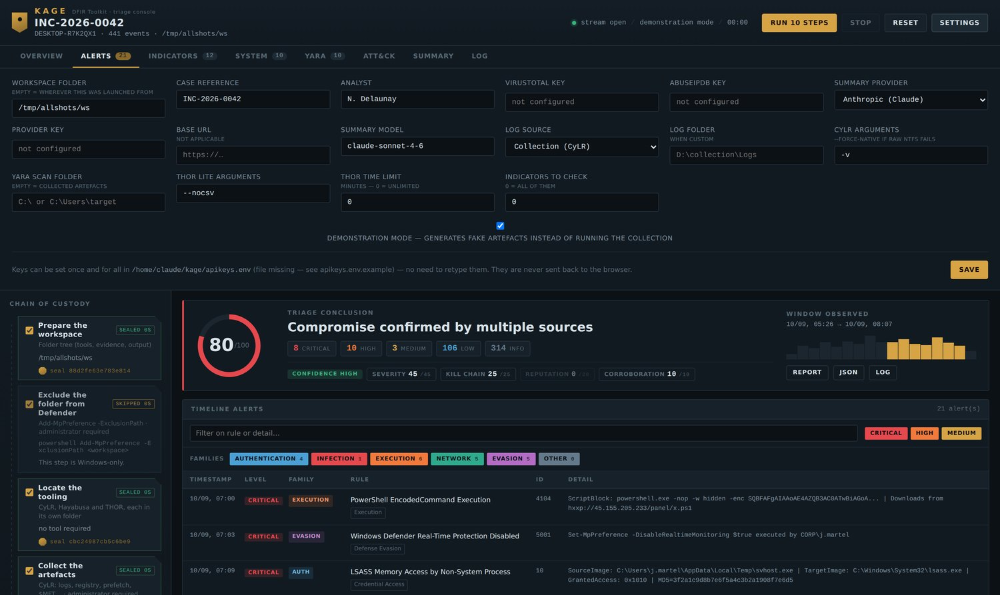

### Execution log

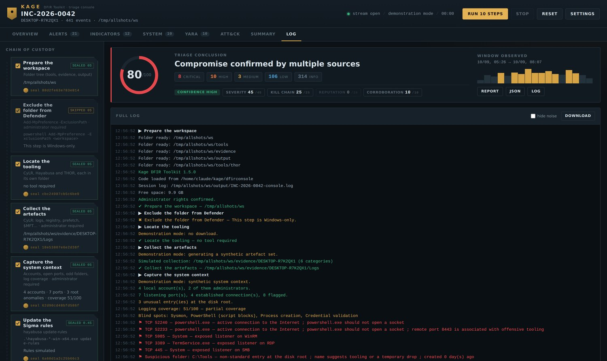

---

## 📄 The report

`/api/report.html` — self-contained, dark, thirteen numbered sections, ready to
print to PDF. No external resource: it stays readable in ten years on an offline
machine.

### Verdict and score

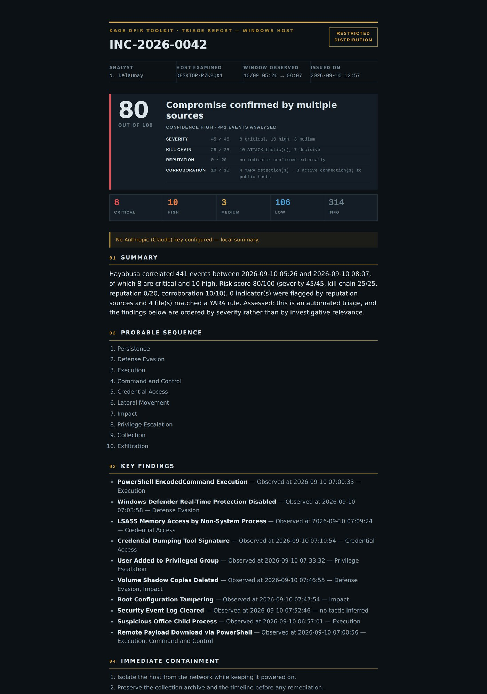

The score never appears without its four components, so a reader can challenge
one axis rather than an opaque number.

### Findings and containment

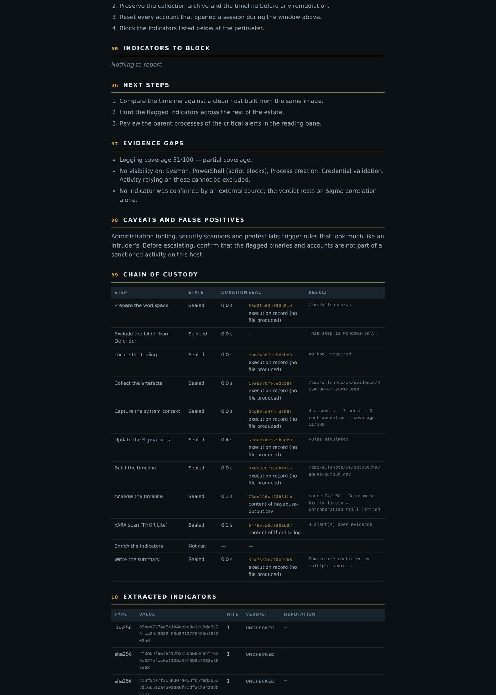

### Evidence gaps and chain of custody

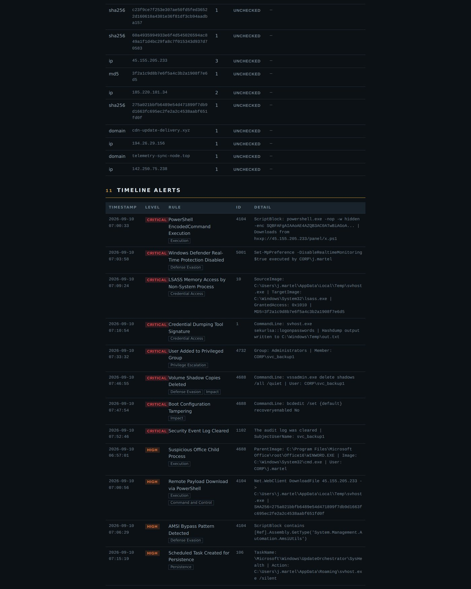

Every step with its seal and **what that seal covers** — the content of a named
file, or the execution record alone.

> When printing to PDF, tick *Background graphics* in the browser options,
> otherwise the dark background is dropped.

---

## ⚙️ Configuration

### Tooling layout

Each tool owns a folder, and each ships with a README explaining what goes in it.

```
<workspace>/
├── tools/
│   ├── cylr/        CyLR.exe                 ← downloaded automatically
│   ├── hayabusa/    hayabusa-<version>.exe   ← downloaded automatically
│   └── thor/        thor64-lite.exe + .lic   ← manual, registration required
├── evidence/        collection archive, unpacked
└── output/          timeline, logs, enrichment cache
```

**CyLR and Hayabusa install themselves.** The *Locate the tooling* step queries
the GitHub releases API, picks the current Windows x64 asset and unpacks it into
the right folder. Pinning a version means the download breaks the day upstream
moves on; resolving it means the console keeps working unattended. A pinned URL
takes over if the API is unreachable.

### API keys — all optional

Everything works without a single key. Unconfigured steps are marked *skipped*,
never *failed*.

**Where credentials go.** The repository ships `apikeys.env.example`, a template
with empty values. Copy it, keep the copy local:

```powershell
copy apikeys.env.example apikeys.env
notepad apikeys.env
```

```ini
# apikeys.env — sits next to launch.bat
VT_API_KEY=your_virustotal_key
ABUSEIPDB_API_KEY=your_abuseipdb_key

AI_PROVIDER=groq
AI_API_KEY=your_provider_key
AI_MODEL=
```

**Where to get them**

| Key | Free tier | Sign up |
|---|---|---|
| `VT_API_KEY` | 4 requests/minute, 500/day | [virustotal.com](https://www.virustotal.com/gui/join-us) |
| `ABUSEIPDB_API_KEY` | 1 000 checks/day | [abuseipdb.com](https://www.abuseipdb.com/register) |
| `AI_API_KEY` | varies — Groq and Ollama are free | see the provider table below |

You can also set them as environment variables instead of a file, which is
usually what you want in a container or on a shared responder workstation:

```powershell
$env:VT_API_KEY = "..."
python -m dfirconsole
```

### Summary providers

Each has its own endpoint, wired explicitly, so choosing Groq never sends your
key to OpenAI.

| Provider | Endpoint | Default model |
|---|---|---|
| Anthropic | `api.anthropic.com` | `claude-sonnet-4-6` |
| OpenAI | `api.openai.com/v1` | `gpt-4o` |
| Groq | `api.groq.com/openai/v1` | `llama-3.3-70b-versatile` |
| Mistral | `api.mistral.ai/v1` | `mistral-large-latest` |
| OpenRouter | `openrouter.ai/api/v1` | `anthropic/claude-sonnet-4` |
| Ollama | `localhost:11434/v1` | `llama3.1` — no key |
| None | — | local write-up |

Small free tiers are handled: Groq allows 12 000 tokens per minute, so the
payload is measured against that ceiling and, on a size rejection, replayed with
fewer alerts and shorter details. The verdict survives; only the supporting
evidence thins out.

The model is held to a standard — observed separated from assessed, calibrated
language, quantified statements, explicit evidence gaps, and the benign
explanation considered.

---

## 📟 CLI reference

```
python -m dfirconsole                  console on 127.0.0.1:8787
python -m dfirconsole --port 9000      custom port
python -m dfirconsole --demo           synthetic data, no collection
python preflight.py                    environment check
python preflight.py D:\CASE42          check another workspace

python -m pytest tests/ -q             115 tests
python tests/ui_check.py               browser: full chain, reading pane
python tests/ui_nav.py                 browser: navigation, counts, histogram
python tests/ui_flood.py               browser: 6000 log lines at once
```

Browser runs need `pip install playwright && playwright install chromium`.

---

## 🔧 Troubleshooting

**"Administrator rights required" / Defender exclusion refused**
Kage is not elevated. Close it, right-click `launch.bat` → *Run as
administrator*, or open PowerShell as administrator first.

**`did not find executable … python.exe`**
Your Python came from the Microsoft Store, which installs per user and vanishes
in an administrator session. Reinstall from python.org, *for all users*.

**CyLR produced no archive / the collection is empty**
Add `--force-native` to **Settings → CyLR arguments**. It drops raw NTFS reading
for the Windows API, which works when partition detection fails on a disk.

**THOR starts then goes silent**
Its licence is missing or expired, or `signatures\` was not copied next to the
binary. Run `preflight.py` to confirm.

---

## 🐧 Linux version — in progress

A Linux triage chain is being built on the same console, same views, same
scoring model. The parsers are already platform-agnostic; what changes is the
evidence layer:

| Windows | Linux (in progress) |
|---|---|
| CyLR collection | UAC / CyLR Linux collection |
| EVTX + Hayabusa Sigma | `journald` / `auth.log` / `syslog` + Sigma |
| `Get-LocalUser` · `auditpol` | `/etc/passwd` · `/etc/shadow` · `auditd` rules |
| `netstat -ano` + `tasklist` | `ss -tunap` |
| Disk root anomalies | `/tmp` · `/dev/shm` · `/var/tmp` · cron · systemd units |
| THOR Lite | THOR Lite for Linux |

Star or watch the repo to catch the release.

---

## 🙏 Credits

Kage is a console, not a collector or a scanner. The heavy lifting belongs to
these projects, and they deserve the star far more than this repo does:

| Tool | Repository | Role in the chain |
|---|---|---|
| **CyLR** | [orlikoski/CyLR](https://github.com/orlikoski/CyLR) | live artefact collection over raw NTFS |
| **Hayabusa** | [Yamato-Security/hayabusa](https://github.com/Yamato-Security/hayabusa) | Sigma correlation, timeline generation |
| **Sigma** | [SigmaHQ/sigma](https://github.com/SigmaHQ/sigma) | the detection rules behind every alert |
| **THOR Lite** | [NextronSystems/thor-lite](https://github.com/NextronSystems/thor-lite) | YARA and IOC scanning |
| **VirusTotal** | [virustotal.com](https://www.virustotal.com) | hash, IP and domain reputation |
| **AbuseIPDB** | [abuseipdb.com](https://www.abuseipdb.com) | IP abuse scoring |
| **MITRE ATT&CK** | [attack.mitre.org](https://attack.mitre.org) | the tactic framework behind the kill-chain axis |

Respect each project's own licence and terms of use — THOR Lite in particular
requires registration with Nextron and is not redistributable.

---

## 🌐 Ecosystem

| | Tool | Domain |
|---|---|---|
| ☁️ | [**Kumo** 蜘蛛](https://github.com/karim852/KUMO-Domain-Recon-Tool) | domain OSINT & reconnaissance |
| 🌑 | **Kage** 影 | DFIR host triage |

---

> ⚠️ **For authorized incident response only.**
> Only run Kage on hosts you own or have explicit written permission to examine.
<p align="center"><sub>Built for those who arrive after. 影</sub></p>
